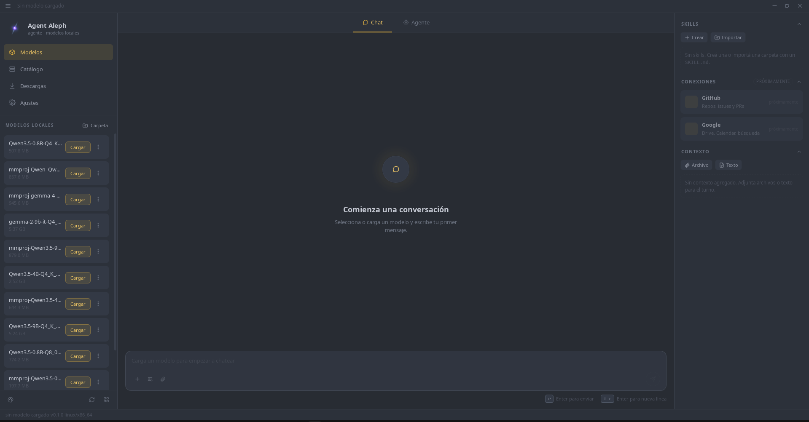

<p align="center">
  <picture>
    <source media="(prefers-color-scheme: dark)" srcset="docs/logo-light.png">
    
  </picture>
</p>

# Agent Aleph

> **A local-first AI coding agent and GGUF model manager.** Download a model, load it with
> one click, and ask an agent to read, edit, and run commands inside your project — no cloud,
> no API keys, no accounts. Everything runs on your machine.

<p align="center">
  
</p>

Agent Aleph combines two workflows in a single desktop app:

- **A local model manager** inspired by LM Studio: browse GGUF models from Hugging Face,
  download them, load/unload them with one click, and tune inference settings.
- **A coding agent** inspired by Codex and Claude Code: a tool-loop harness with permissions,
  build/plan modes, project context, skills, and file-system access scoped to the folder you choose.

The inference engine is **llama.cpp** (`llama-server`), bundled as a precompiled binary and
controlled through its OpenAI-compatible API. You do not need to install or configure a
separate model server.

---

## Why Agent Aleph?

- 🔒 **100% local and private.** Your prompts, source code, and models stay on your machine.
- 🧰 **An agent, not just a chat box.** It can read files, search, edit, create files, and run
  shell commands with your approval.
- 🪶 **Simple by design.** One window: download, load, work. No hosted endpoints or server setup.
- 🛡️ **Safe by default.** Per-tool `allow` / `ask` / `deny` permissions and a read-only
  **plan mode** that cannot write to disk.
- ⚡ **Built for imperfect local models.** GBNF grammar-constrained tool calls, native tool
  calling when the model supports it well, loop detection, and context compaction.
- 🧩 **Extensible with skills.** Add task-specific local instruction packs without changing code.

---

## Features

### Agent

- **State-aware agent loop** with step limits and loop detection. Successful writes/commands
  reset repetition tracking, so the agent can safely inspect files it just changed.
- **7 built-in tools**: `read_file`, `list`, `glob`, `grep`, `write_file`, `edit`, `bash`.
- **Automatic tool-calling route selection**: native OpenAI-style tools (`tools` + `--jinja` +
  `delta.tool_calls`, including multiple tools per step) for capable models, or per-tool
  **GBNF grammars** as a universal fallback for smaller models. Configurable in Settings:
  `auto` / `native` / `GBNF`.
- **Per-tool permissions** (`allow` / `ask` / `deny`) with UI confirmation before writes or
  command execution.
- **Build / plan modes**: build mode can use every enabled tool; plan mode is read-only.
- **Session working directory**: file tools are restricted to the project folder you choose.
- **Automatic project context**: `AGENTS.md` and `CLAUDE.md` are injected into the system
  prompt when present, following the same pattern as Claude Code and opencode.
- **Context compaction with summaries**: when the conversation approaches the context limit,
  older turns are summarized instead of simply discarded.
- **Skills**: local instruction/resource packs (`SKILL.md`) that can be enabled from the
  agent panel for specialized tasks.
- **Attached context**: drag files or paste text into the agent panel to include it in a turn
  without asking the model to read it first.
- **Persistent sessions** with memory across turns.

### Models

- **Curated catalog** (Qwen 3.5 / 3.6, Phi-4, Gemma 4, including MoE and QAT variants) plus
  free search and Hugging Face Hub exploration by downloads, likes, trending, or recent models.
- **Use-case topic chips**: Code, Reasoning, Uncensored, Agent, Roleplay, Legal, Medical, and
  Finance searches. For niche areas with fewer models, Agent Aleph surfaces strong generalists
  first and then specialized models, with an explicit note.
- **Hardware fit badge**: each model gets a 🟢 / 🟡 / 🔴 fit estimate based on detected free
  GPU VRAM plus system RAM, weighted toward VRAM, so you can tell whether it should run smoothly,
  spill to CPU, or not fit.
- **Editable catalog and topics without recompiling**: loaded from a local
  `~/.config/agent-aleph/catalog.json` with an embedded fallback.
- **Download progress** with speed and cancellation for GGUF files.
- **Load progress** with a live percentage during model initialization.
- **Local model management**: list, load, unload, delete, and use external model folders.
- **Streaming chat** token by token in Ask mode.
- **Resizable side panels** whose widths persist across sessions.

### Inference

- Settings: system prompt, temperature, top_p, max_tokens, context size, repeat penalty,
  threads, and GPU layers.
- Runtime controls: KV-cache quantization, `mmap` / `mlock`, batch size, and automatic GPU-layer
  fitting.

---

## Installation

> **Platform:** Linux x64 (Ubuntu/Debian with `webkit2gtk-4.1`, `gtk-3`).
> Requires **Rust 1.77+** and **Node 18+**.

```bash
git clone https://github.com/matiasA/AgentAleph.git
cd AgentAleph
npm install
./scripts/setup-llama.sh   # downloads the llama.cpp binary; it is not committed because of its size
npm run tauri dev          # development with hot reload
# or
npm run tauri build        # production build (.deb / .AppImage)
```

The `llama-server` binary is **not versioned** in git because it is large (~130 MB).
`setup-llama.sh` downloads the pinned official llama.cpp release and places it in
`src-tauri/binaries/llama-linux-x64/`. The default flavor is Vulkan x64. For CPU-only:

```bash
LLAMA_FLAVOR=x64 ./scripts/setup-llama.sh
```

### Build Installers With CI

The `.deb` and `.AppImage` installers are built by GitHub Actions when you request them:

- **Manually:** open the *Actions* tab, choose *Build installers*, then run the workflow.
- **By version tag:** push a `vX.Y.Z` tag to create a GitHub Release with installers attached.

```bash
git tag v0.1.0 && git push origin v0.1.0   # triggers build + Release
```

Agent Aleph creates these local directories:

- `~/.local/share/agent-aleph/models/` — downloaded GGUF models
- `~/.config/agent-aleph/settings.json` — persistent settings

---

## Quick Start

1. **Download** a model from the Catalog tab, usually Q4_K_M by default.
2. **Load** it from the Models tab and wait for the progress indicator.
3. **Choose a mode**: Chat for normal conversation, Agent for project work.
4. **Work with the agent**: select a project folder, describe the task, then approve or deny
   write/execute actions when prompted.

---

## GPU

`setup-llama.sh` downloads the **Vulkan x64** build by default, so GPU offload works out of
the box with NVIDIA, AMD, and Intel through Vulkan. Agent Aleph detects available GPUs and
free VRAM, reflects that in the hardware fit badge, and automatically distributes layers when
auto-fit is enabled. You can also set **GPU layers** manually in Settings.

Prefer another backend? Pass `LLAMA_FLAVOR` to the setup script:

```bash
LLAMA_FLAVOR=x64             ./scripts/setup-llama.sh   # CPU-only
LLAMA_FLAVOR=rocm-7.2-x64    ./scripts/setup-llama.sh   # AMD ROCm
LLAMA_FLAVOR=sycl-fp16-x64   ./scripts/setup-llama.sh   # Intel oneAPI
```

The downloaded binaries include their runtime libraries, so you do not need to install the
full toolkit system-wide. For a specific CUDA build, replace the contents of
`src-tauri/binaries/llama-linux-x64/` with the matching binaries and `.so` files from the
[llama.cpp releases](https://github.com/ggml-org/llama.cpp/releases).

---

## Recommended Models By Hardware

> Current bundled catalog reference. Approximate sizes assume **Q4_K_M** quantization.
>
> You do not need to memorize this table: the app detects GPU + RAM and marks each model with
> a 🟢 / 🟡 / 🔴 hardware-fit badge.

| Hardware | Recommended model (Q4_K_M) | Approx. size |
|----------|-----------------------------|--------------|
| 8 GB RAM, CPU | Qwen 3.5 0.8B / 2B | ~0.5-1.3 GB |
| 16 GB RAM, CPU | Qwen 3.5 4B / Phi-4 mini | ~2.5 GB |
| 16 GB RAM + 6-8 GB GPU | Qwen 3.5 9B / Gemma 4 E4B | ~5 GB |
| 24-32 GB RAM/VRAM | Phi-4 14B / Gemma 4 12B | ~7-9 GB |
| 32 GB+ RAM or VRAM (MoE) | Qwen 3.6 35B-A3B *(MoE, ~3B active -> fast)* | ~18-22 GB |

For **agent mode**, prefer a model that is strong at code and tool use. Use the **Code** or
**Agent** topic chips, or try an MoE model such as **Qwen 3.6 35B-A3B**, which behaves like a
larger model while staying faster because only part of the network is active per token.
Very small models (<=1B) are useful for testing the flow but are less reliable on real tasks.

---

## Stack

- **Tauri 2** (Rust backend + native webview)
- **Svelte 5** (runes) + TypeScript + Vite
- **llama.cpp** (precompiled binary, OpenAI-compatible API)
- **Hugging Face Hub API** for model catalog and downloads

---

## Status And Roadmap

The core agent is implemented: tool loop, 7 tools, permissions, build/plan modes, rich
messages, GBNF/native tool-calling with model-aware selection, context compaction, project
context, skills, attached context, and persistent sessions.

The prioritized backlog lives in [`ROADMAP.md`](./ROADMAP.md): real GitHub/Google
connections, subagents, MCP, slash commands, permission diffs in the UI, and runtime metrics
such as tokens/sec and context usage.

### Current Limitations

- One chat session at a time.
- One loaded model at a time.
- No externally exposed OpenAI-compatible API; llama-server is internal.
- No vision/multimodal support.
- Linux x64 bundle only. Windows and macOS require their own `llama-server` binaries.
- **Connections** for GitHub and Google are visible in the agent panel but are placeholders.
  Real integration requires network access and OAuth, which are outside the current 100%-local
  scope.

---

## License

MIT — see [`LICENSE`](./LICENSE). The bundled `llama-server` keeps its own license
(llama.cpp MIT license, see `src-tauri/binaries/llama-linux-x64/LICENSE`).
